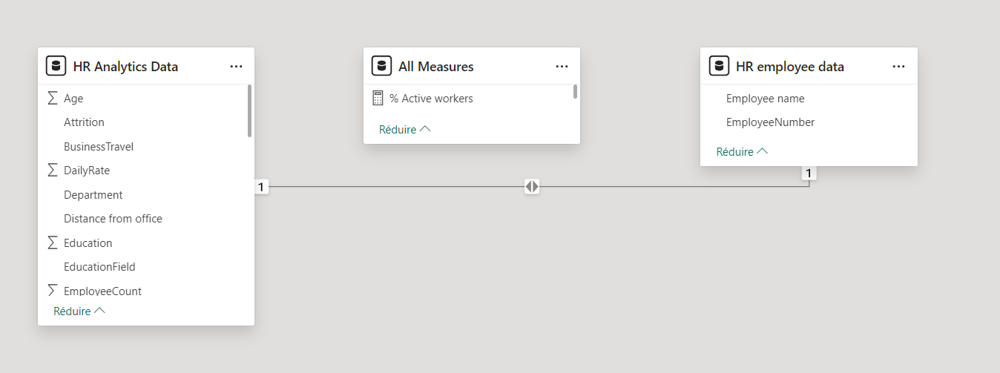
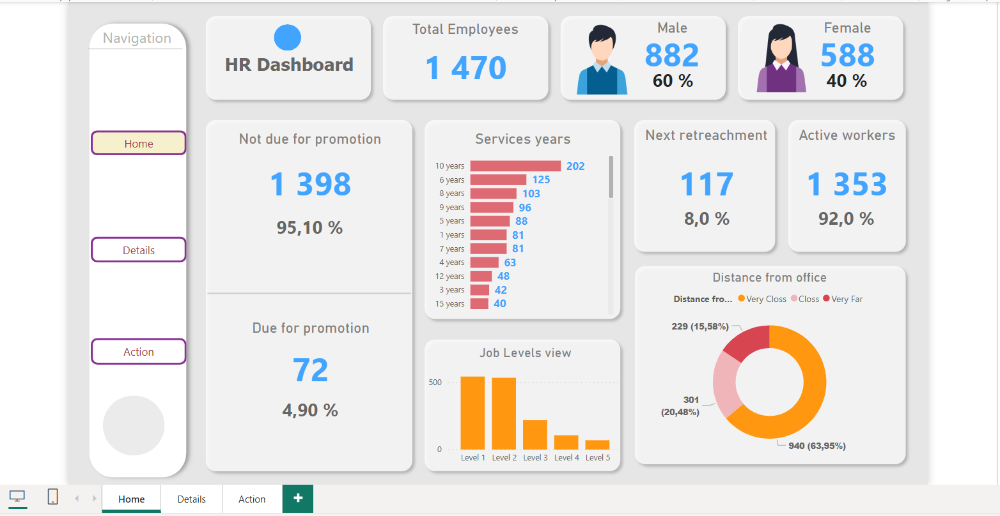
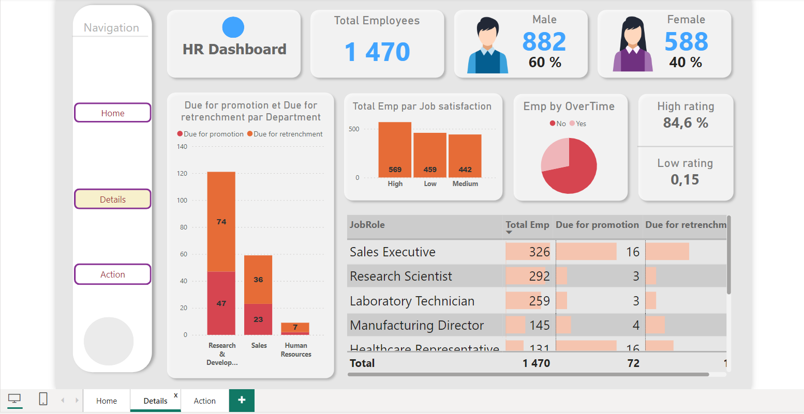
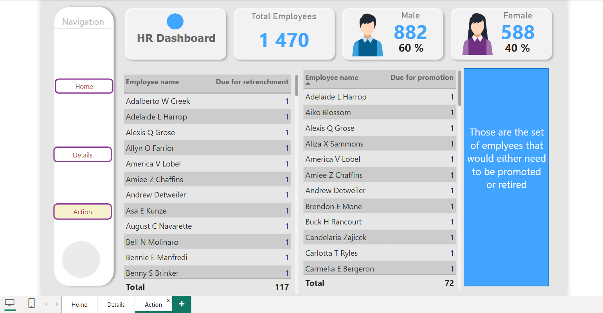

##  Vue d'ensemble

Ce projet vise à identifier les principaux facteurs entraînant l'attrition des employés et à fournir des recommandations pratiques pour améliorer la rétention du personnel au sein d'une organisation. Le tableau de bord fournit des informations clés sur l'attrition au sein de l'organisation, facilitant ainsi l'analyse ultérieure de l'équipe des ressources humaines.
Au cours de ce projet, j'ai eu l'opportunité de :

* Explorer en profondeur les données RH pour dégager des insights précieux.
* Développer des tableaux de bord interactifs pour visualiser les principaux indicateurs RH.
* Formuler des recommandations basées sur les données pour guider la prise de décision stratégique.

##  Problématique

* Répartition des employés hommes et femmes.
* Nombre d'employés en attente de promotion par département.
* Nombre d'employés approchant de l'âge de la retraite par département.
* Taux de satisfaction des employés par catégorie.
* Distance de résidence des employés par rapport au bureau, classée par catégories.
* Nombre d'employés en attente de promotion par poste.
* Identification des employés devant être promus et de ceux devant prendre leur retraite dans l'entreprise, par département et par poste.

##  Préparation des données

* Le nettoyage est effectué en supprimant les colonnes vides, en éliminant les doublons, les erreurs, etc.
* Remplacement des valeurs de colonne par les valeurs appropriées et renommage.
* Détection du type de données de chaque colonne à l'aide de la fonction de détection automatique de type de données dans l'éditeur Power Query.

##  Modélisation des données
  

En observant les deux tableaux ci-dessus, nous remarquons qu'ils partagent tous deux une colonne commune "EmployeeNumber", qui est la clé dans les deux tableaux. Un avantage de Power BI est sa capacité à détecter ces clés et à créer une connexion dans le modèle de données.

## Analyse des données :

* L'analyse implique la création d'une gamme de représentations visuelles, notamment des diagrammes à barres, des indicateurs de performance clés (KPI), des graphiques de tableaux, des graphiques circulaires et d'autres visualisations pertinentes.
* Ces outils sont utilisés pour obtenir des insights et présenter les données de manière compréhensible et complète.

## Visualisation des données

Le rapport est composé de 3 pages :
* Home:

* Details:

* Action:

## Insights tirés de l'analyse

   * L'entreprise compte un total de 1470 employés, dont 882 hommes et 588 femmes.
   * 72 employés sont en attente de promotion.
   * 117 sont susceptibles d'être licenciés.
   * La plupart des employés habitent à proximité du bureau.
   * Le niveau un compte le plus grand nombre d'employés par niveau de poste.
   * Parmi tous les rôles, le poste de Manager est celui qui compte le plus grand nombre d'employés en attente de promotion et de licenciement.
   * Le poste de Sales Executive est celui qui compte le plus grand nombre d'employés.

## Recommandations

   * Personnaliser les stratégies RH en fonction des insights sur la satisfaction au travail.
   * S'attaquer au taux d'attrition pour conserver les talents précieux.
   * Examiner les structures salariales pour garantir la compétitivité.
   * Mettre en place des stratégies de recrutement ciblées en fonction des insights sur le parcours éducatif.

## Contact

Pour toute question, veuillez me contacter à : messaoud.daanoune@gmail.com